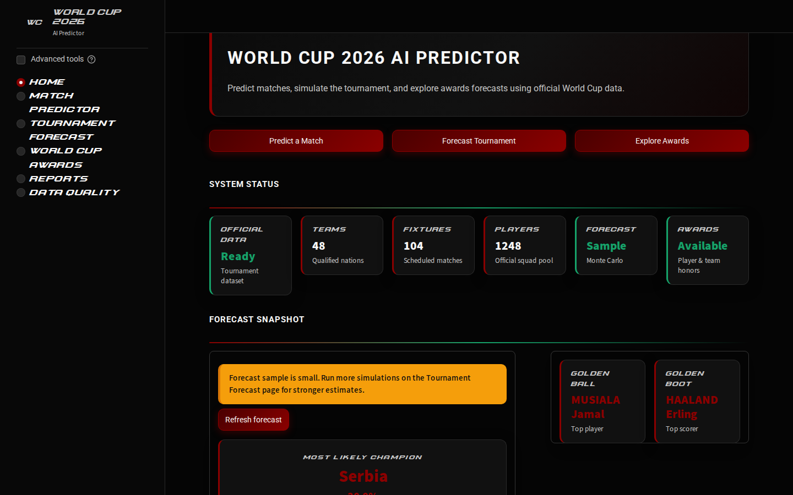
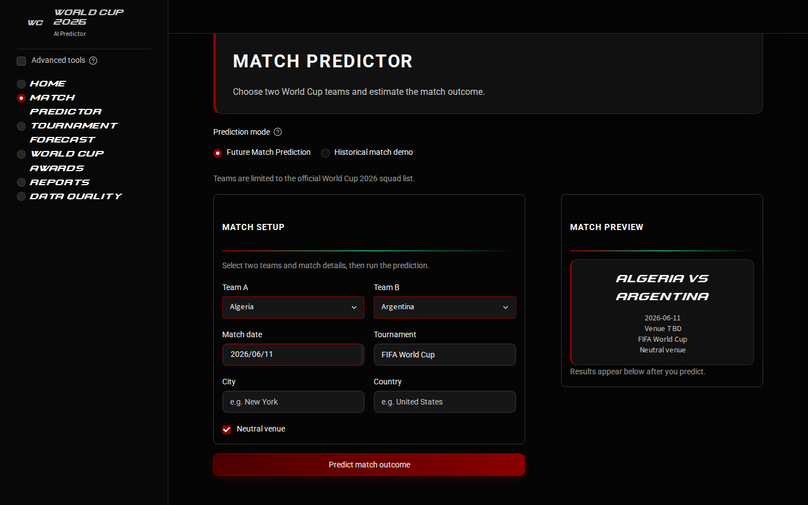
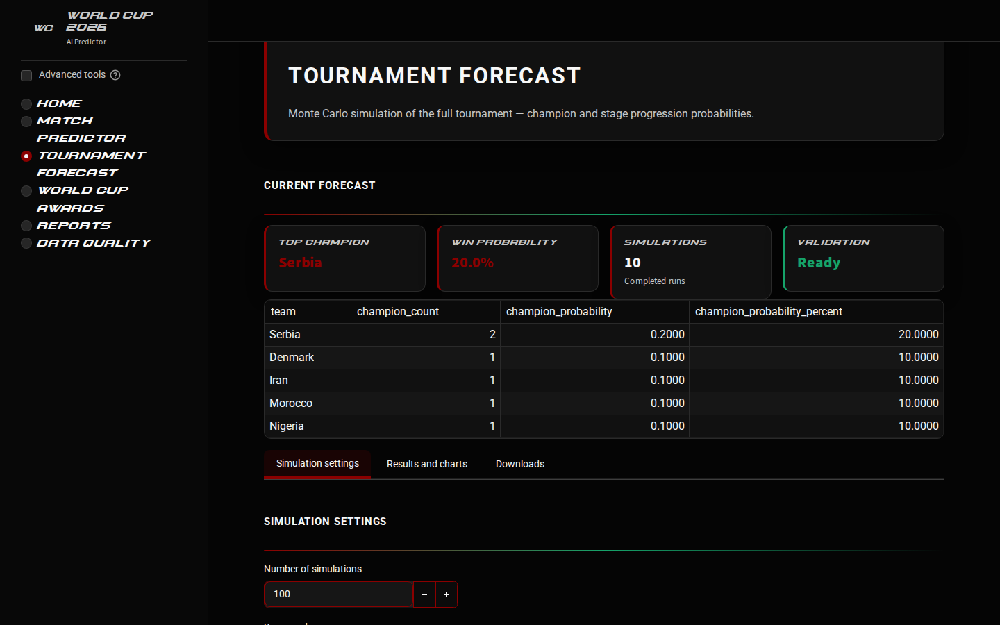
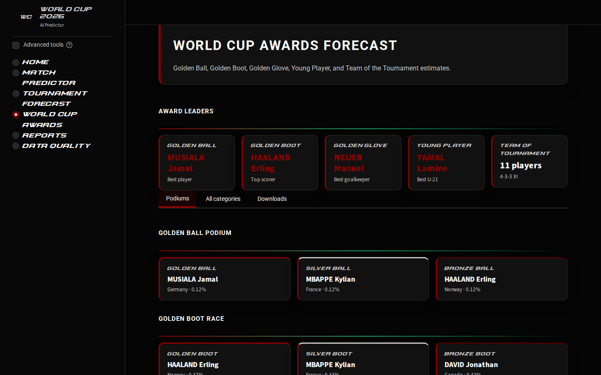
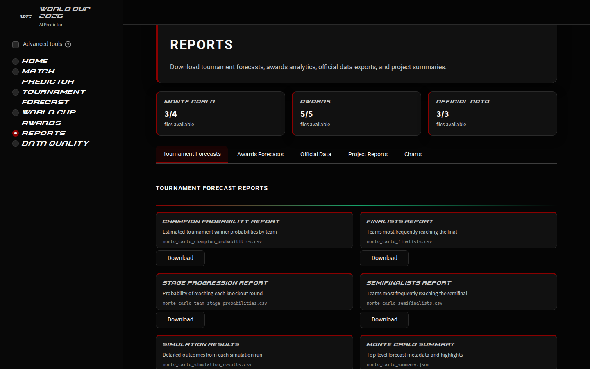
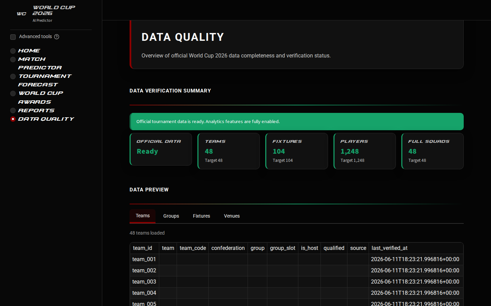

# FIFA World Cup 2026 AI Predictor

A full-stack sports analytics and machine learning project for predicting, simulating, and analyzing the FIFA World Cup 2026 using official tournament data, historical match results, team-strength features, Monte Carlo simulation, and explainable award forecasting.

This project is designed as a serious portfolio-level machine learning system. It goes beyond a simple match predictor by combining:

* official World Cup 2026 teams, fixtures, venues, and squads
* historical international match data
* ranking and Elo-style team strength features
* match outcome prediction
* full tournament simulation
* Monte Carlo probability estimation
* official-data validation gates
* awards forecasting using only official squad players
* Streamlit dashboard for interactive use

> This project produces explainable analytics estimates. It is not affiliated with FIFA and does not provide official FIFA predictions or betting advice.

## App Screenshots

| Home command center | Match Predictor |
| --- | --- |
|  |  |

| Tournament Forecast | World Cup Awards |
| --- | --- |
|  |  |

| Reports | Data Quality |
| --- | --- |
|  |  |

---

## Table of Contents

* [App Screenshots](#app-screenshots)
* [Project Overview](#project-overview)
* [Core Features](#core-features)
* [Why This Project Is Different](#why-this-project-is-different)
* [System Architecture](#system-architecture)
* [Project Status](#project-status)
* [Data Sources](#data-sources)
* [Official Data Gate](#official-data-gate)
* [Machine Learning Pipeline](#machine-learning-pipeline)
* [Tournament Simulation](#tournament-simulation)
* [Monte Carlo Forecasting](#monte-carlo-forecasting)
* [World Cup Awards Predictor](#world-cup-awards-predictor)
* [Streamlit App](#streamlit-app)
* [Repository Structure](#repository-structure)
* [Installation](#installation)
* [How to Run](#how-to-run)
* [Important Scripts](#important-scripts)
* [Main Outputs](#main-outputs)
* [Testing](#testing)
* [Limitations](#limitations)
* [Future Improvements](#future-improvements)
* [Disclaimer](#disclaimer)

---

## Project Overview

The **FIFA World Cup 2026 AI Predictor** is an end-to-end football analytics system that estimates match outcomes, simulates the full tournament path, runs Monte Carlo tournament forecasts, and generates award prediction estimates.

The project was built in stages, starting from basic data cleaning and model training, then expanding into official World Cup data validation, tournament simulation, and award forecasting.

The final system can answer questions such as:

* Which team is most likely to win a specific match?
* Which teams are most likely to reach each tournament stage?
* Which team has the highest simulated chance of winning the World Cup?
* Which players are projected as top candidates for Golden Ball, Golden Boot, Golden Glove, and Young Player?
* How reliable is the official tournament data currently loaded into the system?

---

## Core Features

### Match Prediction

Predicts the outcome of a match between two World Cup teams.

Supported outputs include:

* Team A win probability
* Draw probability
* Team B win probability
* Most likely outcome
* Optional model explanation

---

### Tournament Simulation

Simulates the FIFA World Cup 2026 structure using official data:

* 48 teams
* 12 groups
* 72 group-stage fixtures
* 32 knockout fixtures
* 104 total matches

The system supports:

* group-stage simulation
* best third-placed team qualification
* Round of 32 bracket setup
* knockout simulation
* single-run tournament path
* champion, runner-up, third-place, and fourth-place outputs

---

### Monte Carlo Forecasting

Runs repeated tournament simulations to estimate stage probabilities.

Outputs include:

* champion probabilities
* finalist probabilities
* semifinalist probabilities
* stage reach probabilities
* full simulation results
* downloadable Monte Carlo reports

---

### Official Data Validation

The project includes a strict official-data validation system.

It checks:

* 48 official teams
* 104 official fixtures
* 16 official venues
* 1,248 official players
* 48 complete squads
* 26 players per team
* no placeholder teams
* no sample data in official mode
* no unofficial players in award predictions

---

### Awards Predictor

The awards predictor estimates candidates for:

* Golden Ball
* Silver Ball
* Bronze Ball
* Golden Boot
* Silver Boot
* Bronze Boot
* Golden Glove
* Young Player Award
* Fair Play Trophy
* Most Entertaining Team
* Team of the Tournament
* Player of the Match proxy
* Goal of the Tournament proxy

All player awards are restricted to official squad players only.

---

## Why This Project Is Different

Most football prediction projects stop at simple match prediction.

This project adds several deeper layers:

1. **Official Data Lock**
   The model does not blindly predict with random teams or players. Official teams, fixtures, venues, and squads must pass validation.

2. **Full Tournament Simulation**
   It does not only predict isolated matches. It simulates the full World Cup structure.

3. **Monte Carlo Forecasting**
   It estimates uncertainty by running repeated tournament simulations.

4. **Player Award Forecasting**
   Awards are generated only from official squad players, not sample or random players.

5. **Readiness Gate**
   The system blocks final predictions if official data is incomplete or invalid.

6. **Explainable Outputs**
   Reports and validation files are generated for transparency.

---

## System Architecture

```text
Raw Data
   |
   v
Data Cleaning and Standardization
   |
   v
Feature Engineering
   |
   v
Model Training
   |
   v
Future Match Prediction
   |
   v
Official World Cup Data Lock
   |
   v
Tournament Fixture and Squad Validation
   |
   v
Group Stage Simulation
   |
   v
Knockout Simulation
   |
   v
Full Tournament Simulation
   |
   v
Monte Carlo Forecasting
   |
   v
Awards Predictor
   |
   v
Streamlit Dashboard and Reports
```

---

## Project Status

Current major modules:

| Module                            | Status      |
| --------------------------------- | ----------- |
| Data cleaning                     | Complete    |
| Feature engineering               | Complete    |
| Baseline model                    | Complete    |
| Improved model                    | Complete    |
| Ranking and Elo integration       | Complete    |
| Future match predictor            | Complete    |
| Streamlit predictor UI            | Complete    |
| Model explainability              | Complete    |
| Tournament setup                  | Complete    |
| Group-stage simulation            | Complete    |
| Knockout simulation               | Complete    |
| Full tournament simulation        | Complete    |
| Monte Carlo simulator             | Complete    |
| Monte Carlo reports               | Complete    |
| Official data lock                | Complete    |
| Official squads and player priors | Complete    |
| Official final readiness gate     | Complete    |
| Official FIFA data import         | Complete    |
| Awards predictor                  | Complete    |
| UI/UX redesign                    | In progress |

---

## Data Sources

The project supports multiple data layers.

### Historical Match Data

Used for training the match prediction model.

Examples:

* historical international match results
* match dates
* home/away/neutral status
* team names
* scores
* shootout outcomes where available

### Team Strength Data

Used to improve prediction quality.

Examples:

* FIFA ranking-style features
* Elo-style team strength features
* recent form
* rolling goal statistics
* historical head-to-head features

### Official World Cup 2026 Data

Used for official tournament mode.

Includes:

* official teams
* official groups
* official fixtures
* official venues
* official squads
* official players
* official award candidates

### Player Prior Data

Used for award estimation.

Includes:

* player rating prior
* expected minutes share
* goals prior
* assists prior
* chance creation prior
* defensive actions prior
* goalkeeper actions prior
* discipline risk
* star role score
* flair score

---

## Official Data Gate

A major part of this project is the official-data gate.

The app should not run final official tournament predictions unless the data is complete and verified.

The official-data gate checks:

```text
Teams: 48
Fixtures: 104
Group-stage fixtures: 72
Knockout fixtures: 32
Players: 1,248
Teams with 26 players: 48
Sample rows: 0
Blocking placeholders: 0
Official final mode: enabled
```

If the gate fails, final official predictions and awards are blocked.

This prevents unrealistic outputs such as:

* non-qualified teams appearing in the tournament
* fake fixtures
* placeholder venues
* sample players winning awards
* incomplete squad data being treated as official

---

## Machine Learning Pipeline

The machine learning pipeline includes:

### 1. Data Cleaning

Standardizes match data by:

* cleaning team names
* handling missing values
* removing duplicates
* standardizing dates
* creating canonical match records
* processing shootouts where available

### 2. Feature Engineering

Creates pre-match features such as:

* recent team form
* rolling goals scored
* rolling goals conceded
* win/draw/loss history
* neutral venue flag
* home/away strength
* ranking difference
* Elo difference
* head-to-head indicators

The feature pipeline is designed to avoid data leakage by using only information available before each match.

### 3. Model Training

The project includes:

* baseline classifier
* improved classifier
* ranking-enhanced classifier
* model comparison reports
* temporal backtesting
* probability quality reports

### 4. Match Prediction

The trained model predicts:

* Team A win
* Draw
* Team B win

---

## Tournament Simulation

The tournament simulation system uses official World Cup 2026 structure.

### Group Stage

The group-stage simulator:

* simulates all group-stage matches
* builds group tables
* ranks teams
* selects top two from each group
* selects best third-placed teams
* produces Round of 32 qualifiers

### Knockout Stage

The knockout simulator:

* fills bracket placeholders
* simulates knockout matches
* prevents draws in knockout outcomes
* produces winner, runner-up, third place, and fourth place

### Full Tournament

The full tournament orchestrator connects:

```text
Group Stage → Round of 32 → Round of 16 → Quarter-finals → Semi-finals → Final
```

---

## Monte Carlo Forecasting

Monte Carlo simulation runs the full tournament repeatedly.

The output is a probability distribution, not a single fixed prediction.

Generated outputs include:

* champion probability
* finalist probability
* semifinalist probability
* stage reach probabilities
* simulation result logs
* visual report artifacts

Example outputs:

```text
monte_carlo_simulation_results.csv
monte_carlo_team_stage_probabilities.csv
monte_carlo_champion_probabilities.csv
monte_carlo_summary.json
monte_carlo_report.md
```

---

## World Cup Awards Predictor

The awards predictor uses:

* official player list
* official squads
* player priors
* team progression probabilities
* position-specific scoring weights
* Monte Carlo team probabilities

Awards estimated:

| Award                        | Level      |
| ---------------------------- | ---------- |
| Golden Ball                  | Player     |
| Silver Ball                  | Player     |
| Bronze Ball                  | Player     |
| Golden Boot                  | Player     |
| Silver Boot                  | Player     |
| Bronze Boot                  | Player     |
| Golden Glove                 | Goalkeeper |
| Young Player Award           | Player     |
| Fair Play Trophy             | Team       |
| Most Entertaining Team       | Team       |
| Team of the Tournament       | Player XI  |
| Player of the Match proxy    | Player     |
| Goal of the Tournament proxy | Player     |

The awards predictor does not claim to predict official FIFA awards. It produces analytics-based estimates.

---

## Streamlit App

The Streamlit app provides an interactive interface for:

* checking official data quality
* predicting individual matches
* running tournament simulations
* viewing Monte Carlo forecasts
* exploring awards forecasts
* downloading reports

Recommended user-facing pages:

```text
Home
Match Predictor
Tournament Forecast
Monte Carlo Forecast
World Cup Awards
Reports
Data Quality
```

Technical pages should be hidden under advanced/admin tools.

---

## Repository Structure

```text
world-cup-2026-ai-predictor/
│
├── app/
│   ├── streamlit_app.py
│   ├── pages/
│   ├── components/
│   └── styles/
│
├── data/
│   ├── raw/
│   ├── sample/
│   ├── processed/
│   └── official/
│
├── models/
│   ├── baseline/
│   ├── improved/
│   └── ranking_enhanced/
│
├── reports/
│   ├── figures/
│   └── *.csv / *.md
│
├── scripts/
│   ├── run_monte_carlo.py
│   ├── generate_world_cup_awards.py
│   ├── evaluate_official_final_readiness.py
│   └── ...
│
├── src/
│   ├── data/
│   ├── features/
│   ├── models/
│   ├── simulation/
│   ├── official/
│   ├── awards/
│   └── reports/
│
├── tests/
│
├── README.md
├── requirements.txt
└── main.py
```

---

## Installation

### 1. Clone the repository

```bash
git clone https://github.com/fzn011/WorldCupPredictionModel.git
cd WorldCupPredictionModel
```

### 2. Create a virtual environment

Windows:

```bash
python -m venv .venv
.venv\Scripts\activate
```

macOS/Linux:

```bash
python -m venv .venv
source .venv/bin/activate
```

### 3. Install dependencies

```bash
pip install -r requirements.txt
```

---

## How to Run

### Run the main pipeline

```bash
python main.py
```

### Run the Streamlit app

```bash
python -m streamlit run app/streamlit_app.py
```

### Run Monte Carlo simulation

```bash
python scripts/run_monte_carlo.py --simulations 10 --seed 42
```

For stronger estimates:

```bash
python scripts/run_monte_carlo.py --simulations 100 --seed 42
```

### Generate Monte Carlo report

```bash
python scripts/generate_monte_carlo_report.py
```

### Check official final readiness

```bash
python scripts/evaluate_official_final_readiness.py
```

### Generate awards forecast

```bash
python scripts/generate_world_cup_awards.py
```

### Inspect awards forecast

```bash
python scripts/inspect_world_cup_awards.py
```

---

## Important Scripts

### Data and Model Pipeline

```text
main.py
```

Runs the core data/model pipeline.

### Dataset Checking

```text
scripts/check_datasets.py
```

Checks whether real or sample datasets are available.

### Kaggle Data Download

```text
scripts/download_kaggle_datasets.py
```

Downloads supported Kaggle datasets if Kaggle credentials are configured locally.

Do not commit Kaggle credentials.

### Tournament Simulation

```text
scripts/simulate_group_stage.py
scripts/simulate_knockout.py
scripts/simulate_full_tournament.py
```

### Monte Carlo

```text
scripts/run_monte_carlo.py
scripts/inspect_monte_carlo_results.py
scripts/generate_monte_carlo_report.py
```

### Official Data

```text
scripts/prepare_official_worldcup_data.py
scripts/prepare_official_squads.py
scripts/evaluate_official_final_readiness.py
scripts/promote_official_final.py
```

### FIFA Import Workflow

```text
scripts/import_fifa_schedule_file.py
scripts/import_fifa_squad_file.py
scripts/apply_populated_official_data.py
scripts/cleanup_official_apply_blockers.py
```

### Awards

```text
scripts/generate_world_cup_awards.py
scripts/inspect_world_cup_awards.py
scripts/generate_golden_ball_predictions.py
scripts/inspect_golden_ball_predictions.py
```

---

## Main Outputs

### Processed Data

```text
data/processed/canonical_matches.csv
data/processed/feature_dataset.csv
data/processed/ranking_feature_dataset.csv
```

### Model Artifacts

```text
models/baseline/
models/improved/
models/ranking_enhanced/
```

### Tournament Outputs

```text
data/processed/group_stage_simulated_matches.csv
data/processed/full_tournament_simulated_matches.csv
data/processed/full_tournament_summary.json
```

### Monte Carlo Outputs

```text
data/processed/monte_carlo_simulation_results.csv
data/processed/monte_carlo_team_stage_probabilities.csv
data/processed/monte_carlo_champion_probabilities.csv
reports/monte_carlo_report.md
```

### Official Data Outputs

```text
data/official/processed/official_teams.csv
data/official/processed/official_fixtures.csv
data/official/processed/official_players.csv
data/official/processed/official_final_mode.json
```

### Awards Outputs

```text
data/processed/world_cup_awards_predictions.csv
data/processed/golden_ball_predictions.csv
data/processed/golden_boot_predictions.csv
data/processed/golden_glove_predictions.csv
data/processed/team_of_the_tournament.csv
reports/world_cup_awards_report.md
```

---

## Testing

Run all tests:

```bash
python -m pytest -q
```

Run a specific test file:

```bash
python -m pytest tests/test_future_match_features.py -q
```

Expected result in the latest stable build:

```text
All tests passing
```

---

## Reproducibility Workflow

A recommended end-to-end run:

```bash
python main.py
python scripts/evaluate_official_final_readiness.py
python scripts/run_monte_carlo.py --simulations 10 --seed 42
python scripts/generate_monte_carlo_report.py
python scripts/generate_world_cup_awards.py
python scripts/prepare_final_project_pack.py
python -m pytest -q
python -m streamlit run app/streamlit_app.py
```

---

## Security Notes

Do not commit:

```text
kaggle.json
API keys
tokens
.env files
private credentials
```

Kaggle credentials should be stored outside the repository, for example:

```text
%USERPROFILE%\.kaggle\kaggle.json
```

The project should never hardcode credentials.

---

## Limitations

This project is an analytics estimate, not a guarantee.

Important limitations:

* football matches are highly uncertain
* model quality depends on training data quality
* player priors can strongly affect awards rankings
* no live injury data is included unless manually added
* no real-time lineup information is included unless manually added
* no live tactical information is included
* fan-voted awards are only proxy estimates
* official FIFA data can change and should be refreshed
* Monte Carlo estimates depend on simulation count
* low simulation counts are useful for demos but not strong probability estimates

---

## Future Improvements

Possible next improvements:

* richer player priors from public football statistics
* live injury and lineup integration
* date-aware historical ranking joins
* better calibration of match probabilities
* more advanced team strength modeling
* richer visualization for bracket paths
* improved Streamlit UI/UX
* deployment to Streamlit Community Cloud
* automated screenshot generation for portfolio
* better award priors for differentiated player rankings

---

## Disclaimer

This project is an educational and portfolio-oriented football analytics system.

It is not affiliated with FIFA.

It does not provide official FIFA predictions.

It does not provide betting advice.

All outputs are probabilistic analytics estimates based on available data, model assumptions, and simulation logic.

---

## Author

Built by **Faiyaz Zahin** as a machine learning, data science, and sports analytics portfolio project.

GitHub: `fzn011`
